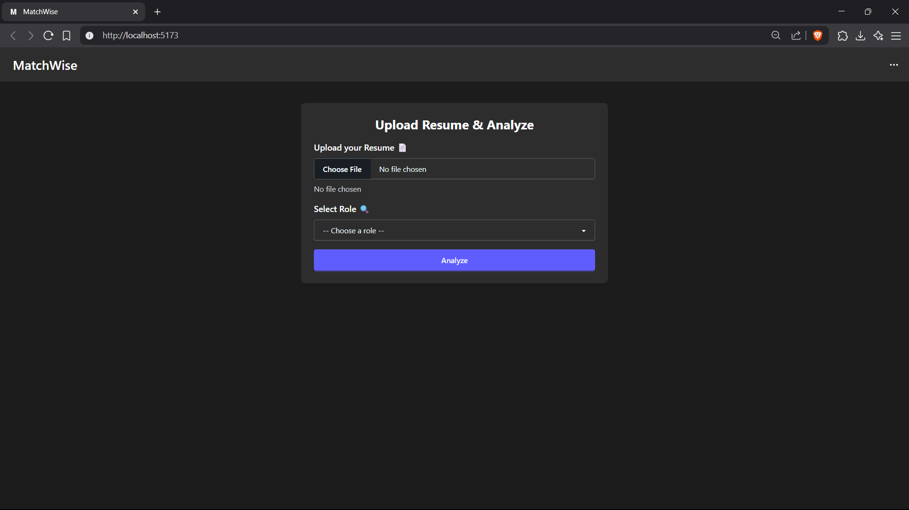
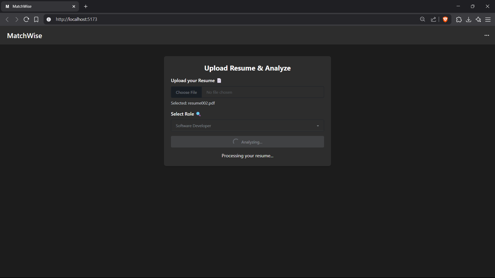
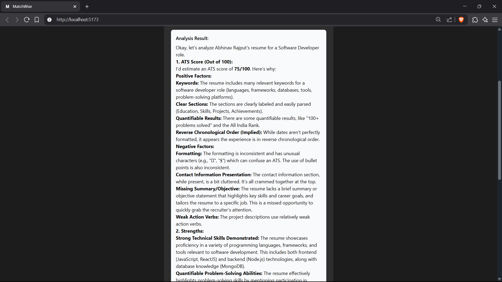

# MatchWise
This is a web-based **resume analysis tool** that leverages AI for content evaluation. It parses uploaded PDF resumes and uses the **Google Gemini API** to perform semantic analysis, extracting insights on structure, keyword density, and formatting effectiveness. The system is designed to assist users in optimizing their resumes for **ATS and recruiter screening algorithms**.

## Features
- Upload resumes in PDF format using Multer for secure and efficient file handling.
- Uses Google Gemini API for AI-powered content evaluation.
- Extracts and parses text to assess structure and formatting.
- Analyzes keyword density and skill relevance.
- Provides feedback on ATS (Applicant Tracking System) compatibility.
- Displays AI insights in a clean, user-friendly React interface.

## Tech Stack
### Frontend
- **React.js** – For building a responsive and dynamic user interface
- **Axios** – For making HTTP requests to the backend
### Backend
- **Node.js** – JavaScript runtime environment
- **Express.js** – Web framework for handling API routes and logic
- **Multer** – Middleware for handling file uploads (PDF resumes)
- **pdf-parse** – For extracting text content from uploaded PDFs
### AI & Integration
- **Google Gemini API** – For AI-powered analysis and feedback generation
### Tools & Utilities
- **dotenv** – For managing environment variables like API KEY securely
- **cors** – For enabling cross-origin communication between frontend and backend

## Preview
<p align="center">
<strong>Homepage</strong><br><br>

</p>

<p align="center">
<strong>Loading Screen</strong><br><br>

</p>

<p align="center">
<strong>Results</strong><br><br>

</p>

## Installation and Setup Guide
### 1. Clone the Repository
```bash
git clone https://github.com/your-username/MatchWise.git
cd MatchWise
```
### 2. Backend Setup
```bash
cd backend
npm install
```
Create a `.env` file in the `backend\` folder:
```bash
GEMINI_API_KEY=your_gemini_api_key
PORT=5000
```
Start the backend server:
```bash
node server.js
```
or (if you use nodemon)
```bash
nodemon server.js
```
### 3. Frontend Setup
```bash
cd ../matchwise-ats
npm install
```
Start the frontend development server:
```bash
npm run dev
```
### 4. Usage
- Open your browser and go to [http://localhost:5173](http://localhost:5173) (or the port shown in your terminal).
- Upload your resume, select a role, and click "Analyze" to get instant feedback.
### 5. Key Considerations
- Make sure your backend (`localhost:5000` by default) is running before using the frontend.
- **Never commit your `.env` file or API keys to public repositories.**
## Contributing
Contributions are welcome! If you have suggestions for improvements, bug fixes, or new features, please open an issue or submit a pull request.  
Before contributing, please make sure your code follows the project’s coding standards and is well-documented.
## License
This project is licensed under the MIT License. See the [LICENSE](LICENSE) file for details.
## Contact
For questions, feedback, or collaboration opportunities, feel free to reach out via [LinkedIn](https://www.linkedin.com/in/abh1navvv/) or open an issue on this GitHub repository.
